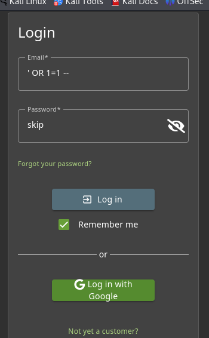

#Vulnerability Report: Authentication Bypass via Burp Suit

**Advanced Exploitation via Interception Proxy:**
Alternatively, this vulnerability can be exploited by intercepting the raw HTTP traffic bypassing any potential client-side JavaScript validation. 
1. Route browser traffic through Burp Suite.
2. Intercept the `POST /rest/user/login` request.
3. Modify the JSON body to inject the payload directly into the `email` parameter: `{"email":"' OR 1=1 --","password":"test"}`
4. Forward the modified request to the server.

**Evidence of Raw HTTP Manipulation:**

# Vulnerability Report: Authentication Bypass via SQL Injection

**Target Application:** OWASP Juice Shop (Local Docker Instance)
**Vulnerability Type:** SQL Injection (SQLi)
**Severity Rating:** Critical 
**Date of Testing:** March 24, 2026

---

### 1. Executive Summary
During a security assessment of the Juice Shop web application, a critical SQL Injection vulnerability was discovered in the user authentication mechanism. This flaw allows an unauthenticated attacker to bypass the login screen entirely and gain unauthorized access to any user account, including the system Administrator. Immediate remediation is required to prevent data breaches and unauthorized system control.

### 2. Technical Details
The vulnerability exists in the `email` input field on the `/login` page. The application fails to properly sanitize user input before passing it into a backend SQLite database query. By injecting specific SQL characters, an attacker can manipulate the query's logic to force the database to return a "TRUE" statement, effectively neutralizing the password validation check.

### 3. Steps to Reproduce (Proof of Concept)
1. Navigate to the target login page at `http://localhost:3000/#/login`.
2. In the **Email** input field, inject the following payload: 
   `' OR 1=1 --`
3. In the **Password** field, enter any arbitrary text (e.g., `test`).
4. Click the **Log in** button.

**Evidence of Payload Injection:**

5. **Result:** The application grants access to the first user record in the database (the Administrator) without requiring a valid password.

**Evidence of Successful Exploitation:**

### 4. Business Impact
If exploited in a production environment, this vulnerability allows a malicious actor to achieve full account takeover. An attacker acting as the Administrator could view sensitive Personally Identifiable Information (PII) of all customers, modify financial records, deface the website, or pivot to attack the underlying server infrastructure.

### 5. Remediation Recommendations
To resolve this vulnerability, the development team must stop relying on dynamic SQL string concatenation. 
* **Implement Prepared Statements:** Use parameterized queries for all database interactions. This ensures the database treats user input strictly as data, not as executable code.
* **Input Validation:** Implement strict allow-listing on the email input field to reject any characters outside of standard email address formats.# Vulnerability Report: Authentication Bypass via SQL Injection

**Target Application:** OWASP Juice Shop (Local Docker Instance)
**Vulnerability Type:** SQL Injection (SQLi)
**Severity Rating:** Critical 
**Date of Testing:** March 24, 2026

---

### 1. Executive Summary
During a security assessment of the Juice Shop web application, a critical SQL Injection vulnerability was discovered in the user authentication mechanism. This flaw allows an unauthenticated attacker to bypass the login screen entirely and gain unauthorized access to any user account, including the system Administrator. Immediate remediation is required to prevent data breaches and unauthorized system control.

### 2. Technical Details
The vulnerability exists in the `email` input field on the `/login` page. The application fails to properly sanitize user input before passing it into a backend SQLite database query. By injecting specific SQL characters, an attacker can manipulate the query's logic to force the database to return a "TRUE" statement, effectively neutralizing the password validation check.

### 3. Steps to Reproduce (Proof of Concept)
1. Navigate to the target login page at `http://localhost:3000/#/login`.
2. In the **Email** input field, inject the following payload: 
   `' OR 1=1 --`
3. In the **Password** field, enter any arbitrary text (e.g., `test`).
4. Click the **Log in** button.

**Evidence of Payload Injection:**

5. **Result:** The application grants access to the first user record in the database (the Administrator) without requiring a valid password.

**Evidence of Successful Exploitation:**

### 4. Business Impact
If exploited in a production environment, this vulnerability allows a malicious actor to achieve full account takeover. An attacker acting as the Administrator could view sensitive Personally Identifiable Information (PII) of all customers, modify financial records, deface the website, or pivot to attack the underlying server infrastructure.

### 5. Remediation Recommendations
To resolve this vulnerability, the development team must stop relying on dynamic SQL string concatenation. 
* **Implement Prepared Statements:** Use parameterized queries for all database interactions. This ensures the database treats user input strictly as data, not as executable code.
* **Input Validation:** Implement strict allow-listing on the email input field to reject any characters outside of standard email address formats.
